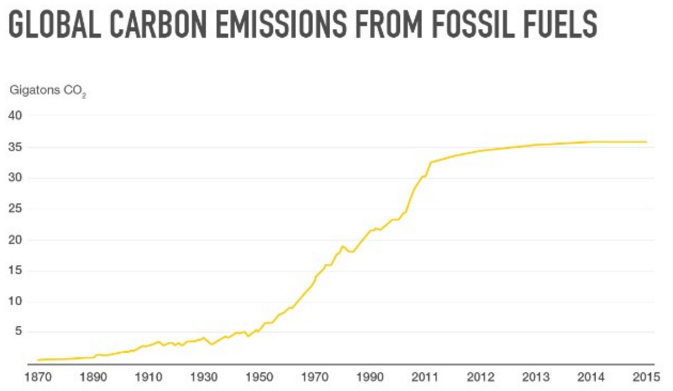

```{r setup, include=FALSE}
knitr::opts_chunk$set(echo = TRUE)
library(TSA)
library(ggplot2)
library(dplyr)
```

# 1. Based on the Tufte's rule or Cleveland's principles and our discussions in the class, identify at least eight distinct problems of the plot below. Explain each of the problems you identified in terms of the specific rule it is violating.


**Answer:**

### What is wrong with this plot

1. This chart is unnecessarily 3-D. This violates Tufte's data-ink ratio principle, and Cleveland's principle of avoiding superfluity.
2. Color is unnecessary here, as there are only two variables, which can be represented by an x, y axis. This is superfluous and would be considered non-data-ink that should be removed.
3. The precision of the labels go to the hundredths, but the data are whole numbers. This is superfluous and should be removed. Cleveland also mentions that we should not feel obligated to include a zero point if it adds no value.
4. There is a lie factor here due to the plot being 3-D. The bars do not exactly line up with the grid lines, making them appear larger than they are. This is most apparent on the Opera line, which looks to be at 0%, but is probably actually around 1-2%.
5. The data are represented as pieces of a whole which should add up to 100%, but these do not. This is not showing the data. An "Other" category should be shown here.
6. This plot lacks a title and therefore cannot be interpreted on its own. This lacks a clear vision.
7. The graph lines are a distance behind the bars, so it is hard to gauge the actual level of the bars. This makes the lie factor worse. 
8. Color is gradient, which is also unnecessary. This non-data-ink should be erased.

\pagebreak

# 2. Based on the 13 criteria discussed in class, evaluate the following plot in terms of each criterion.
 


**Answer:**

1. The message here is that women work more unpaid hours per day than men, and that the number is most disproportionate in the Middle East and North Africa, and South Asia, while North Americans work the least unpaid hours and that while women still work more than men, the numbers are closer than the other regions.
2. There is no Kairos.
3. The audience could be academics, economists, or just citizens interested in gender equality.
4. The data are unpaid hours worked per day, gender, region.
5. Region is on the x-axis, unpaid hours worked per day on the y-axis, and gender is encoded by color.
6. This is a conventional bar chart graphic.
7. The data are accurately represented, although the data appear to be continuous, but are plotted against a discrete grid. It is easy to visualize the relative amount, but impossible to determine the exact value for each bar. This may or may not be important, depending on the audience.
8. The data-ink ratio is low. The grid lines are subdued and not emphasized, and the color is used to represent a variable. 
9. The only thing possibly missing are the exact unpaid hours worked values, which appear to be continuous values not shown. Again, this may or may not be important depending on the audience.
10. The information is presented very clearly.
11. The data and labels are emphasized, while the grid lines are de-emphasized. 
12. The viewer is drawn in by the red bars, which represent the unpaid hours worked by women.
13. This is a good plot and it gets its point across.

\pagebreak

# 3. Write down Tufte's rule for an effective graphical display of data. Which rules are violated in the following picture?


**Answer:**

### Tufte's Principles
1. Above all else, show the data
2. Maximize the data-ink ratio
3. Erase non-data-ink
4. Erase redundant data-ink
5. Revise and edit

All of these principles are violated. The data points are very difficult to read, the 3-D and color is superfluous, the top and bottom are simply mirror images and therefore redundant, and there is a huge lie factor. This could be better represented as a simple time series plot:

```{r, fig.height=5, fig.width=5, fig.align="center", echo=FALSE}

y <- c(1972, 1973, 1974, 1975, 1976)
a <- c(28.0, 29.2, 32.8, 33.6, 33.0)

df <- data.frame(a)
df.ts <- ts(df, start=c(1972, 1), freq=1)
plot(df.ts, type="o", ylim=c(20, 35), main="25 and Under College Enrolement", ylab="Percentage", xlab="")
text(x=y, y=a, labels=a, pos=1, offset=-1.5)
```

\pagebreak

# 4. Identify at least five problems for the following display of data about fish population in a certain lake. 


**Answer:**

1. The alignment is not consistent. Numerical values should all be right aligned, column headers should be centered.
2. The percentage sign in the "% fishes die each year" values is redundant, since it is already listed in the header.
3. The precision is not consistent. The right-most two columns are to the thousandths and the hundredths respectively.
4. The Carp column is missing commas, which are used throughout, and there is a missing comma in the Crappie column.
5. The column headings should be bottom-aligned.

\pagebreak


# 5. CNN just published the following picture on Feb 22, 2016. Compute the lie factor in the picture. Discuss what impact we observed due to the lie factor.



**Answer:**

The lie factor can be found in the x-values, where they are 20 years apart until the year 2011, which they are single years apart. 

```{r}
size.of.effect.in.data <- (2015 - 1870) / 2015
size.of.effect.in.graphic <- (11 * 20) / (2015 - 1870)

lie.factor <- size.of.effect.in.graphic / size.of.effect.in.data
```

The lie factor is `r lie.factor` which is much larger than 1, making this graphic unacceptable. A more appropriate graphic would be to show the data as it is from 1870 to 2020 by years of 20, and show predicted values for 2016-2020 as a dashed line.

\pagebreak

# 6. Answer the following questions based on the plot below. The plot shows the enrollment based on class and race. 


## a) We can see the data in the plot. Create a data frame and turn in your data.

**Answer:**

```{r}
enrollment <- read.csv('assignment02/Enrollment.csv')
enrollment$Year <- factor(enrollment$Year, levels = c('freshman', 'sophomore', 'junior', 'senior'))
```

## b) Do you think the plot is the best display of the data? If not, recreate one of the best plots of the data using any software and turn in your plot.

**Answer:**

No. Here is a better plot.

```{r, fig.height=5, fig.width=5, fig.align="center"}
ggplot(enrollment, aes(x = Race, y = Enrollment, fill=Year)) +
  geom_bar(stat="identity") +
  labs(title="Enrollment by class and race")
```

## c) Comment on the data ink ratio of the plot.

**Answer:**

The original plot has a very low data-ink ratio. There is a lot of unnecessary ink, including color, 3-D, and data labels. The revised plot uses only the necessary amount of aesthetics to display the data.


## d) Generate a plot showing average enrollments by race. Do the same for class.

**Answer:**

```{r, fig.height=5, fig.width=5, fig.align="center"}
avg.race <- enrollment %>%
  group_by(Race) %>%
  summarise(mean(Enrollment))

colnames(avg.race) <- c('Race', 'Avg')

ggplot(avg.race, aes(x=Race, y=Avg)) +
  geom_bar(stat="identity") +
  labs(title="Average enrollment by race")
```

```{r, fig.height=5, fig.width=5, fig.align="center"}

avg.year <- enrollment %>%
  group_by(Year) %>%
  summarise(mean(Enrollment))

colnames(avg.year) <- c('Year', 'Avg')

ggplot(avg.year, aes(x=Year, y=Avg)) +
  geom_bar(stat="identity") +
  labs(title="Average enrollment by year")
```

## e) Do you think that race is significant to explain the variations in enrollment? Why? 

We can generate a linear model to determine the effect each factor has on the response variable.

```{r}
enr <- enrollment
enr$RaceNum <- 0
enr$RaceNum[which(enr$Race == 'Asian')] <- 1
enr$RaceNum[which(enr$Race == 'Black')] <- 2
enr$RaceNum[which(enr$Race == 'Hispanic')] <- 3
enr$RaceNum[which(enr$Race == 'Others')] <- 4
enr$RaceNum[which(enr$Race == 'White')] <- 5

enr$ClassNum <- 0
enr$ClassNum[which(enr$Year == 'freshman')] <- 1
enr$ClassNum[which(enr$Year == 'sophomore')] <- 2
enr$ClassNum[which(enr$Year == 'junior')] <- 3
enr$ClassNum[which(enr$Year == 'senior')] <- 4

fit <- lm(Enrollment ~ RaceNum + ClassNum, data=enr)
smry <- summary(fit)
smry
```

It appears that Race only has a p-value of `r smry$coefficients[[2, 4]]`, which is not statistically significant. So we cannot say that race does not explain the variations in enrollment.


## f) Do you think that class is significant to explain the variations in enrollment? Why?

**Answer:**

Again, no. 

Class has a p-value of `r smry$coefficients[[3, 4]]`, which is not statistically significant. So we cannot say that class does not explain the variations in enrollment.

\pagebreak


