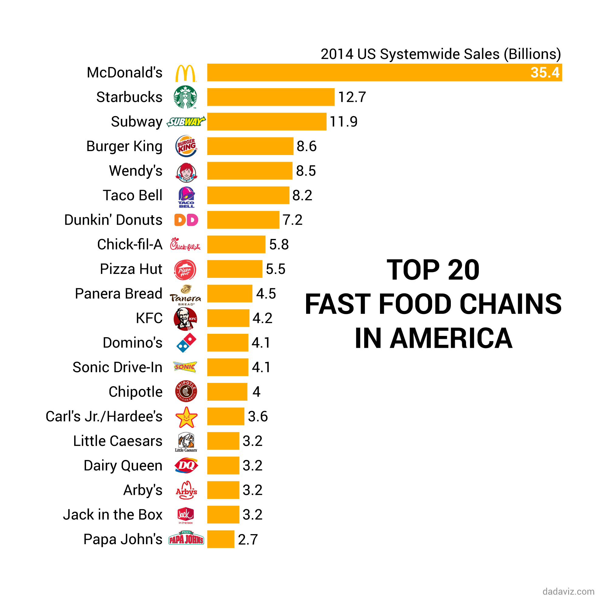

```{r setup, include=FALSE}
knitr::opts_chunk$set(echo = TRUE)
set.seed(0)
library(TSA)
library(ggplot2)
library(reshape2)
library(dplyr)
library(GGally)
```

# 1. Criticizing visual display: Visit dadaviz.com and explore the many data graphics they display. Not all their graphics are good in terms of our principle. Now answer the following questions.

## a) Pick and provide the links for two of the best graphics from this web site. Describe the reasons for your pick.


This plot is clean and easy to read. The states are organized in equal sized boxes rather than as a map, because the main message is the percentage of the state's poulation, not the size of the state. It clearly shows that Vermont and Louisianna stand out on opposite ends of the spectrum. The only criticism is I would have used a grey background so the lighter states can still be read. You can barely make out DC because it's right in the middle of the spectrum. Perhaps a source should be included, though it may have been included in accompanying text.

\pagebreak



This is a simple bar chart, but the addition of the fast food chain logos really makes the data pop out. It is clear to see that McDonald's is a huge leader. It's not even close. There is no lie factor here and the data are clearly displayed. My only criticism here would be the need for Kairos and a listing of the source for the data.

\pagebreak

## b) Identify and provide the links for two of the bad graphics from this web site and explain why  you think they are bad. Clearly mention which princ iple is not satisfied. Also mention an  alternative display that would be preferable.


While this chart is technically ok, when using a bar chart to represent percentages, it necessarily omits the whole. So while the point this chart is trying to make is comparing those who have contemplated suicide in the various stages of high school, it is easy to see the highest bar (24.6% of 9th grade women) as 100% at first glance. I would have used a line chart, since we can see a trend in females, and it would better highlight the bump in 11th grade males. I would also argue that the choice of "Men" and "Women" for high schoolers is inappropriate given most are under 18. Males and Females would have been more appropriate.


This chart suffers from inconsistent precision and formatting. The percentage signs could have been removed and the title changed to "10 Year Job Growth Percentage (2005-2014)". Single decimal place precision should be used everywhere. 

\pagebreak

## c) Provide the links for two of the graphics that used some unconventional genre and specifically describe why you think they are not conventional.


These three images were combined into an animated GIF. This is an unusual way to represent a timeline without displaying the specific dates, and in a way, it makes this image (or images) visually appealing and interesting. We recognize these world leaders and are able to mentally put a timeline with it. Though this does not quite "show the data", it does provoke thought.

\pagebreak


This chart plots 7 variables in a unique way. It's goal is to show budgetary gaps in government and government shutdowns under various configurations of the House and Senate and under different presidents. It is visually appealing and effective at displaying a lot of information in a small space.

\pagebreak

## d) In each of the six graphics you have identified above, determine the visual discourse community.

**Figure 1**: The health community, government officials.

**Figure 2**: Investors, consumers

**Figure 3**: Psychologists, mental health professionals, education officials

**Figure 4**: Politicians, economists, voters, workers

**Figure 5**: British citizens, the general public

**Figure 6**: Politicians, voters, US citizens

\pagebreak

## 2. Organizing data for display: In class we presented how to reorganize data to display and generated a scatter plot of French fries data to show the relationship between replication 1 and 2. Generate and provide a similar plot that shows relationships between time 1 and 10 for each of the sensory attributes. Also provide your codes to demonstrate how you generated the plot.

```{r, fig.height=4, fig.width=5, fig.align='center'}
data("french_fries")
ff <- french_fries %>% select(time, potato, buttery, grassy, rancid, painty)
ff.melt <- melt(ff, id.vars = c('time'))
ff.melt.1.10 <- ff.melt %>% filter(time == 1 | time == 10)
head(ff.melt.1.10)
ggplot(ff.melt.1.10, aes(x=variable, y=value, color=time)) +
  geom_boxplot() +
  labs(title="French Fries", x="Sensory Attribute", y="Value", colour="Time")
```


\pagebreak

## 3. Colors palettes in graphics: The following R codes will generate same plot with two different color schemes. Explain what are the differences between those two plots. Which plot do you prefer for display? Explain why.

```{r}
library(ggplot2)
dsamp <- diamonds[sample(nrow(diamonds), 1000), ] 
d <- ggplot(data = dsamp,
            aes(carat, price, colour=clarity)) + 
  geom_point()
d + scale_colour_brewer(palette="Blues")
d + scale_colour_brewer(palette="Set1")
```

## Note: Please don’t try to copy the code to save time. Instead, type them.

I prefer the second one. The clarity we are measuring is on a discrete scale, and the \texttt{Blues} palette is somewhat continuous. Such a scale would be preferrable for continuous data. Since we would like to be able to pick out distinct clarity types, the discrete palette in the second plot makes more sense.

\pagebreak

# 4. Carefully read the article available in the link below and answer the following questions. (arefully read the article available in the link 

[http://cran.r-project.org/web/packages/colorspace/vignettes/hcl-colors.pdf](http://cran.r-project.org/web/packages/colorspace/vignettes/hcl-colors.pdf)

## a) Describe the differences between qualitative, sequential and diverging palette.

Qualitative palettes are used for coding categorical data, while sequential and diverging palettes can be used to code numerical variables.

Qualitative palettes keep chroma and luminance constant and only change the hue to get different colors.

Sequential palettes are used to code data in a numerical range, where we may want to highlight higher or lower values, and deemphasize other uninteresting data.

Diverging palettes are similar to sequential palettes, but we want to highlight two ends of a spectrum and the range includes a neutral value. 

## b) Give example situations for each of these palettes for which they are suitable.

**Qualitative palettes**: The diamond clarity chart as we saw in the last question is a good use case for this.

**Sequential palettes**: Chloropleth maps are often represented using sequential palettes, such as percentage of votes for a presidential candidate.

**Diverging palettes**: The HIV chart (Figure 1) showed a diverging palette. The neutral value was at 10%, which represents the National HIV/AIDS Strategy's goal to lower the number of persons living with undiagnosed HIV infection. Values below that were a gradiant of white to blue, and values above 10% were a gradiant of white to red.

\pagebreak

# 5. Diastolic blood pressure (DBP) was measured 5 times for each of the two treatments (TRT) group of subject. The data is provided in \texttt{diastolicBP.csv}. Generate a good display of the data. Answer the following questions based on the plot you have generated.

The package \texttt{GGAlly} contains a useful function, \texttt{ggpairs} which generates a matrix of plots featuring various combinations of variables. We'll generate this and take a look at some of the interesting plots.

```{r, fig.align='center', warning=FALSE, error=FALSE, message=FALSE}
dia <- read.csv('diastolicBP.csv')
head(dia)
ggpairs(dia)
```

This allows us to see some of the more interesting plots and to potentially perform some deeper analysis.

For instance, we can see a strong correlation in DBP1 and age. And there is some clear cluster separation in DBP5 and the subjects.

```{r, fig.height=4, fig.width=5, fig.align='center'}

fit <- lm(data=dia, DBP1~age)
fit.sum <- summary(fit)
r.sq <- round(fit.sum$r.squared, digits=2)

ggplot(dia, aes(x=age, y=DBP1)) +
  geom_point() +
  geom_abline(intercept = fit$coefficients[[1]], slope = fit$coefficients[[2]]) +
  annotate("text", x = 60, y = 116, label = paste("R^2 =", r.sq))

```  

The linear model suggests an $R^2$ of `r r.sq`.

We can also perform K-means clustering on to show the separation of clusters if we wished to analyse these groups separately.

```{r, fig.height=4, fig.width=5, fig.align='center'}
m <- matrix(c(dia$DBP5, dia$subject), ncol=2)
dia.cluster <- kmeans(m, 2, nstart=2)
dia.cluster$cluster <- as.factor(dia.cluster$cluster)

ggplot(dia, aes(x=subject, y=DBP5, color=dia.cluster$cluster)) +
  geom_point() +
  labs(title="K-Means clustering", color="Cluster")

```

There are several more things we could look at, depending on our domain knowledge.

## a) What is the main message?

It is quite evident that DBP1 increases linearally with age, and that subjects can be separated into two different categories for DBP5 separated by subjects less than or equal to 20, and subjects greater than 20.

## b) What is the sub message?

The data are clearly not random, and we can quickly find patterns in the data by plotting it. 

## c) What numerical summery of the data we glean from the plot?

We can predict values for folks older than what we have. For instance, someone who is 90 years old have an expected DBP1 of `r round(fit$coefficients[[1]] + 90 * fit$coefficients[[2]], digits=2)`.

And subjects 0-20 can expect a DBP5 of 97 - 105, whereas subjects 20-40 can expecct a DBP5 of 108 - 115. (We don't know what these subject numbers mean, but if we did, this would be valuable information.)

\pagebreak

