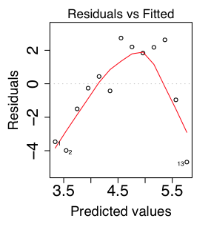
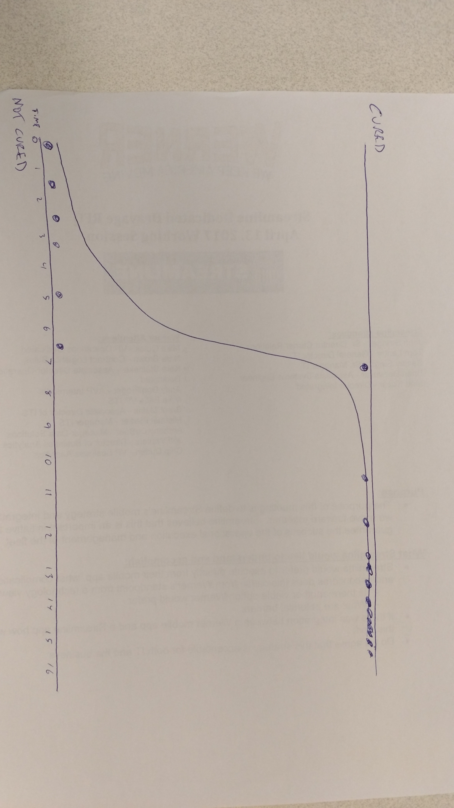
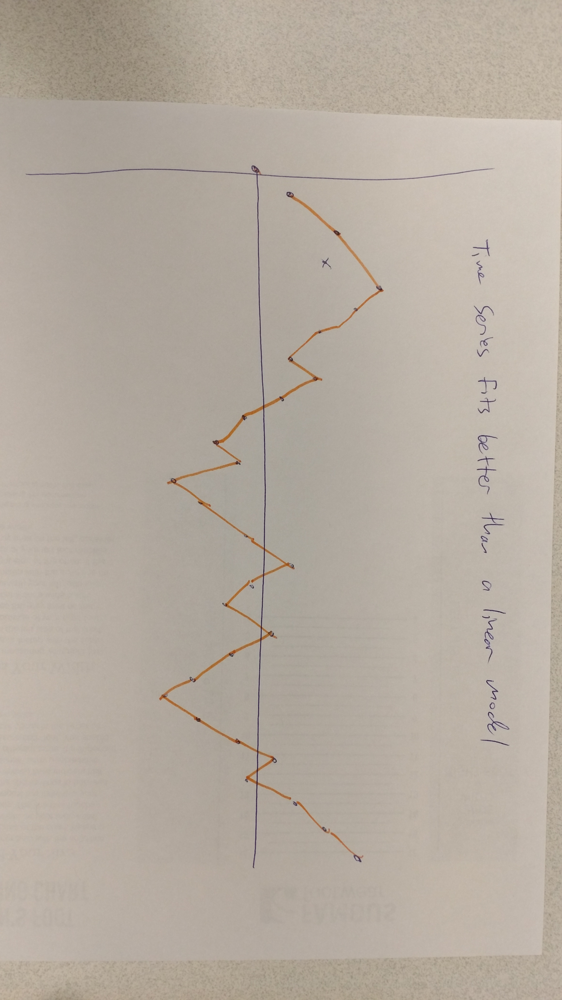

```{r setup, include=FALSE}
knitr::opts_chunk$set(echo = TRUE)
set.seed(0)
library(knitr)
library(TSA)
library(ggplot2)
library(reshape2)
library(dplyr)
library(GGally)
library(ggmap)
```

# 1. Model building: What plot will you generate to motivate that following model will be appropriate to fit to the data

## a) Linear Regression

**Answer:** A Scatter plot can show a linear trend.

## b) Logistic Regression

**Answer:** We would plot two categorical variables along a range of values, one at the top and one at the bottom. There should be a separation somewhere in the middle where we could draw the logistic regression line. Alternatively, a histogram could be applied at the top and bottom to show the distribution of the variables.

## c) Time series

**Answer:** A time series plot - a line connecting points over a time range.

# Model assumptions: Suppose you are planning to fit a linear regression model to the data

## a) What are the assumptions?

**Answer:** We assume independence, normality, linearity, and equal variance.  

## b) What plot will you generate to verify that the assumptions are met and describe why?

**Answer:** We would generate a scatter plot with a least squares regression line drawn through the points. We may also indicate the $R^2$ value.

## c) If the assumptions are not satisfied what will you do?

**Answer:** We may need to transform the data, using such tricks as a log or Box-Cox transformation, or possibly fit a different model such as a quadratic.


# 3. After fitting a linear  regression  model to the data a researcher found following residual plot. Suggest  a solution to overcome the problem.




**Answer:** This plot suggests that the data are not linear. We could fix this by fitting a quadratic model.

# 4. Logistic model: Answer the following questions based on the following data frame.

## a) Sketch a plot of the data (by hand) that may indicate a logistic model should be fit ted to the data.

See Figure 2.




# b) Suppose the slope of the logistic regressi on is obtained to be 0.27, what does it mean  in the con text of the problem?

**Answer:** The slope is the rate of change in the "log odds" as the dependent variable changes.

## c) What plot would you generate to show how good the model is fitted to the data?

**Answer:** We could generate a LOESS regression to verify that the curve is indeed "S" shaped. We can also fit a linear model to determine if the log odds fit the curve.


## 5. Sketch a hypothetical plot that would suggest that a time series model be fitted instead of a linear model. Explain why you think that times series is appropriate based on your plot.

See Figure 3.

